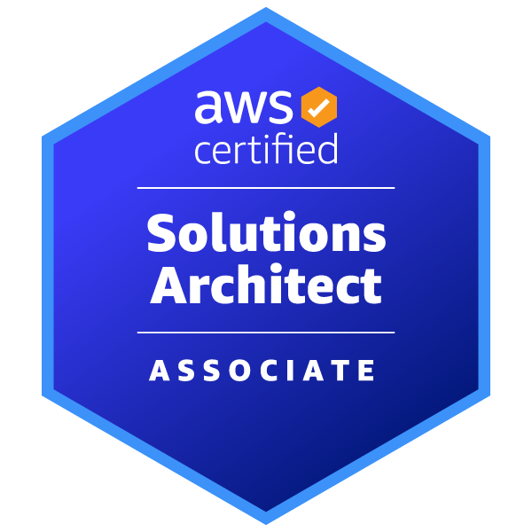
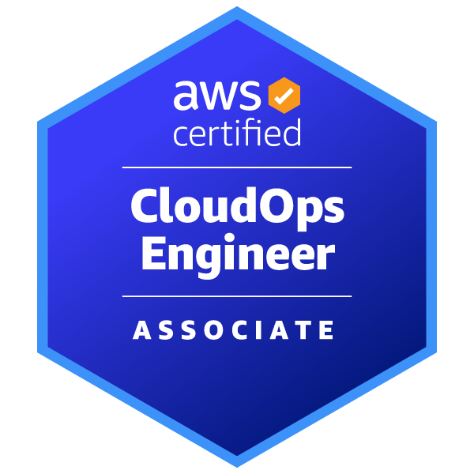
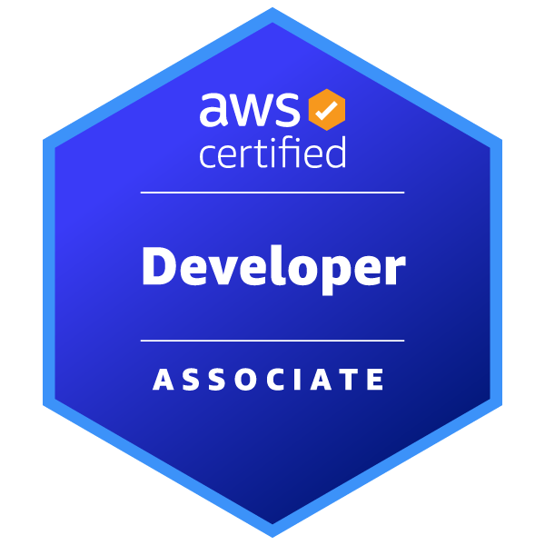
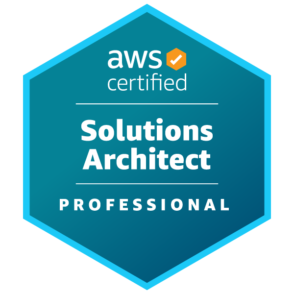
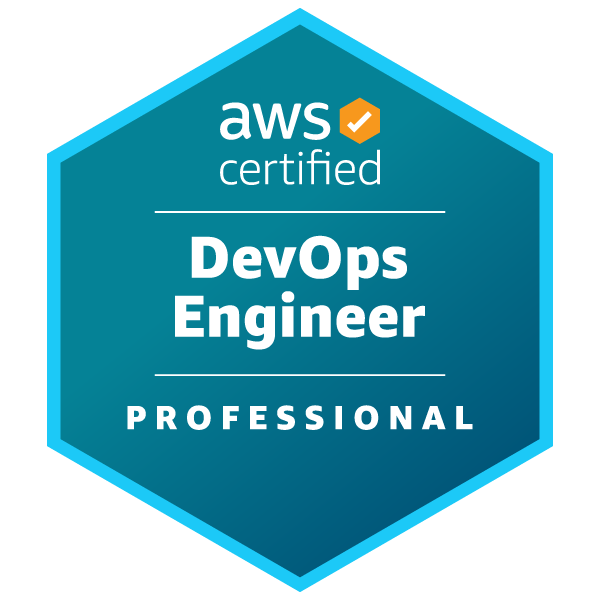
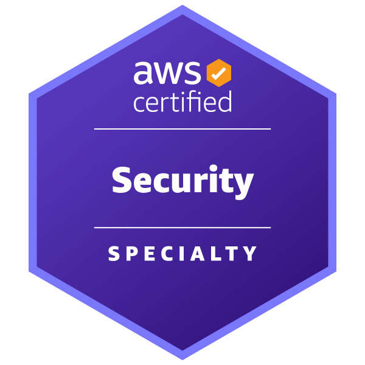
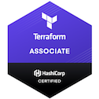

### Hi there 👋

- 🔭 I’m currently working on [Fanvue]([https://www.loka.com/](https://www.fanvue.com/)) as a Sr. Platform Engineer
- 💬 Ask me about AWS, Kubernetes, IaC and other things
- 📫 How to find me:
  - [LinkedIn](https://www.linkedin.com/in/rafavinicius/)
  - [Strava](https://www.strava.com/athletes/51061383)
- ⚡ Fun fact: 
  - Decided to move from cold Amsterdam to beautiful Florianópolis.
  - I love playing football and other activities like running, climbing, and cycling
  - BBQ Master

---
`Certifications`

[Certification validaton](https://www.credly.com/users/rafael-vinicius-cardoso-de-oliveira/badges#credly)

[Certification validaton - old](https://www.youracclaim.com/users/rafael-oliveira.b068d1d3)

  
  
  
  
  
  
  

